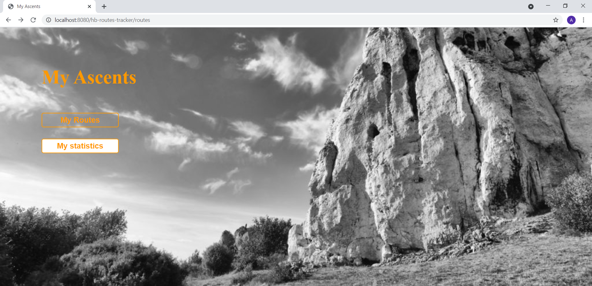
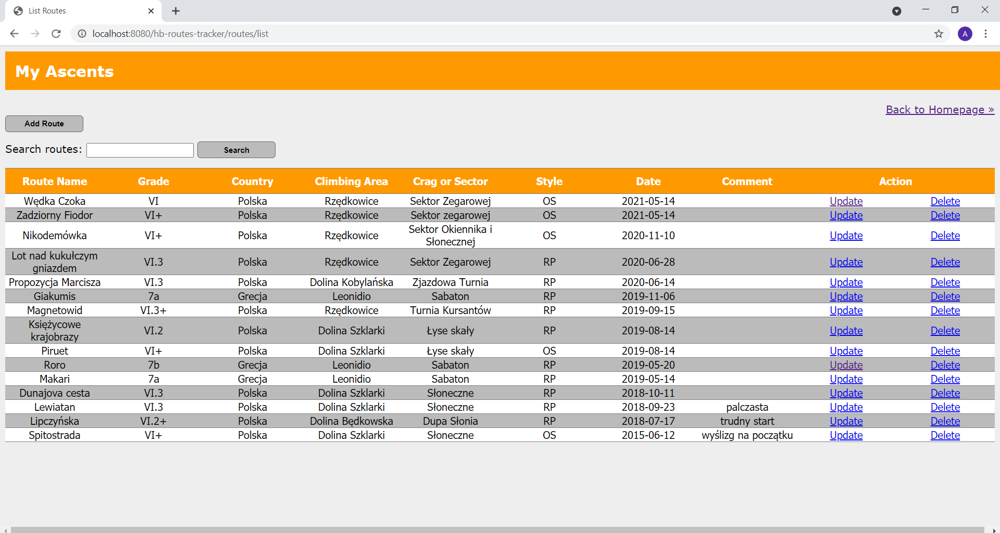
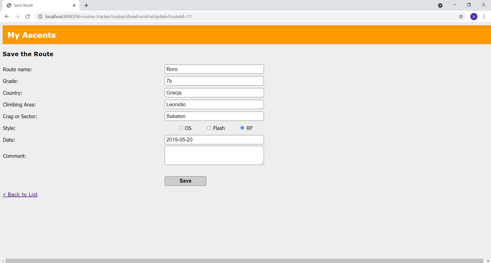
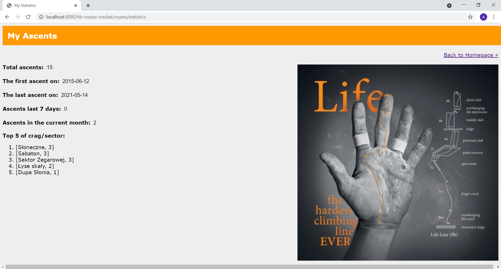

# Routes
***
This is a database web application using Spring MVC and Hibernate.



## Table of Contents
* [General Info](#general-information)
* [Features](#features)
* [Technologies Used](#technologies-used)
* [Setup](#setup)
* [Project Status](#project-status)
* [Room for Improvement](#room-for-improvement)


## General Information 
Memory can be fleeting and it is important for every climber to track their progress:) The project was created for climber who want to record their ascents.

## Features 
This project includes:
- Welcome page
- By clicking the "My Routes" button on the main page, the user will be redirected to the page displaying all the routes he has made
- Routes are saved in the database
- The user can add new routes, edit and delete existing ones 
- Input "search" is used to find any route stored in database
- By clicking the "My statistics" button on the main page, the user will be redirected to the page displaying main climbing statistics based on data form database







## Technologies Used
- Java - version 10.0.2
- Spring - version 5.1.9.Release
- Hibernate - version 5.4.8.Final
- Javax.servlet - version 1.2.1
- Mysql-connector-java - version 8.0.18
- c3p0 - version 0.9.5.3
- JSP 
- CSS
- Tomcat - version 9.0
- MySQL Workbench - version 8.0 CE

## Setup

###### 1. Clone this reposidory to your desktop

###### 2. Install and Configure Database
[Install MySQL database](https://dev.mysql.com/doc/refman/5.7/en/installing.html)

###### 3. Start Database Service
Create database

```
CREATE DATABASE  IF NOT EXISTS `hb_routes_tracker`;
USE `hb_routes_tracker`;

DROP TABLE IF EXISTS `routes`;

CREATE TABLE `routes` (
  `id` int(11) NOT NULL AUTO_INCREMENT,
  `route_name` varchar(100) DEFAULT NULL,
  `grade` varchar(10) DEFAULT NULL,
  `country` varchar(45) DEFAULT NULL,
  `climbing_area` varchar(100) DEFAULT NULL,
  `crag_or_sector` varchar(100) DEFAULT NULL,
  `style` varchar(5) DEFAULT NULL,
  `date_of_ascent` date DEFAULT NULL,
  `note` text DEFAULT NULL,

  PRIMARY KEY (`id`)
) ENGINE=InnoDB AUTO_INCREMENT=1 DEFAULT CHARACTER SET utf8 COLLATE utf8_unicode_ci;
```

###### 4. Install and Configure Web Server
[Setup and Install Apache Tomcat Server in Eclipse Development Environment](https://crunchify.com/step-by-step-guide-to-setup-and-install-apache-tomcat-server-in-eclipse-development-environment-ide/)

## Project Status
Project is in progress.

## Room for Improvement
To do:
- presenting the climbing activity in the form of charts
- expansion of the database with accounts for multiple users


